# ♻️ Recycle App (Flutter)

Recycle App là ứng dụng Flutter giúp người dùng tìm hiểu và quản lý thông tin về tái chế rác thải,
nhằm nâng cao ý thức bảo vệ môi trường.

## 📌 Giới thiệu

Dự án **Recycle App** được xây dựng trong quá trình học Flutter.
Ứng dụng tập trung vào:
- Xây dựng UI với Flutter
- Tổ chức project rõ ràng
- Responsive cho nhiều kích thước màn hình

## 📱 Giao diện ứng dụng

  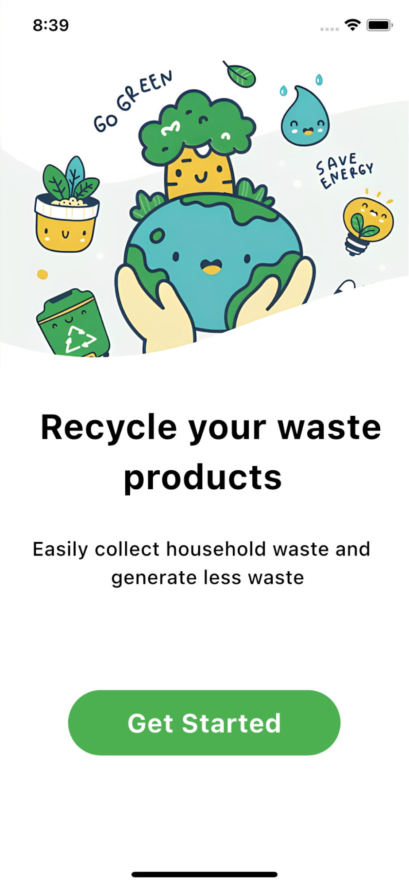

1. Hệ thống đăng ký đăng nhập của người dùng và quản trị viên

  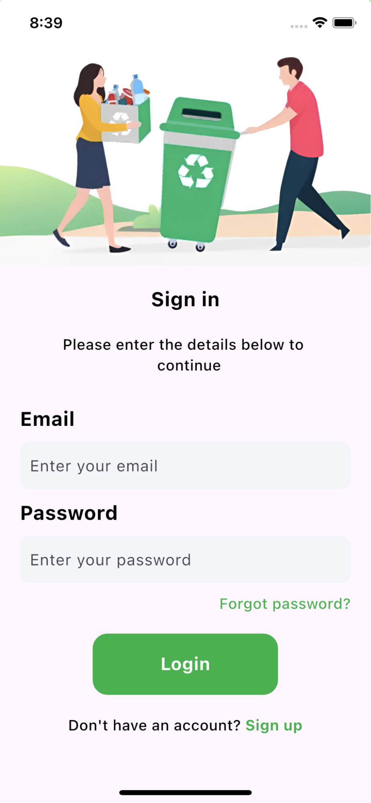
  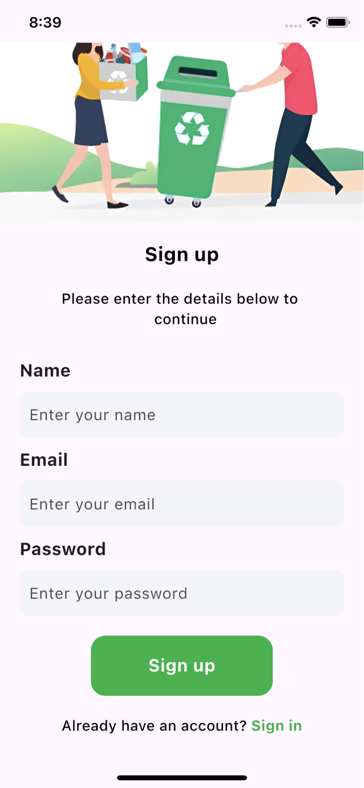
  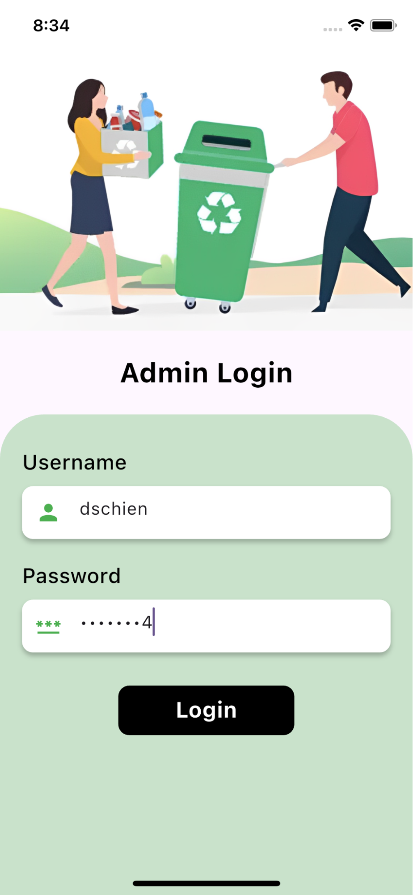

2. Giao diện người dùng

  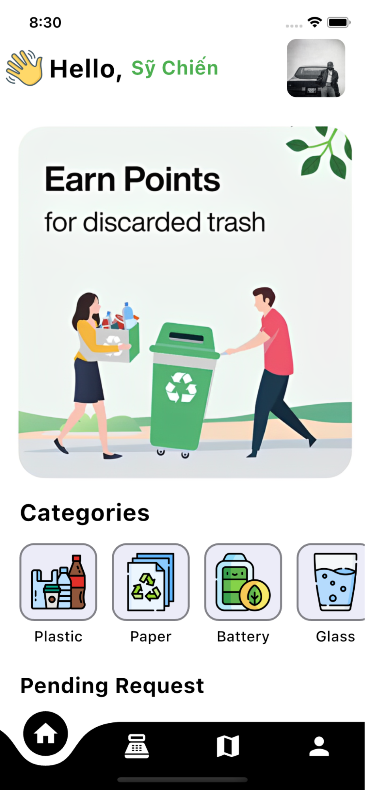
  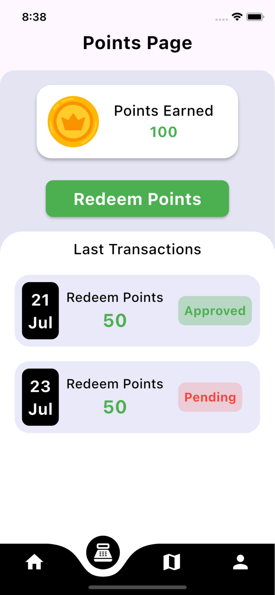
  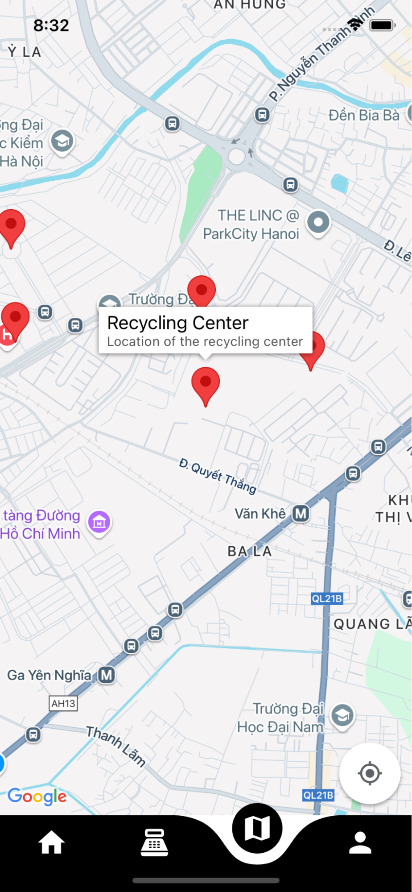
  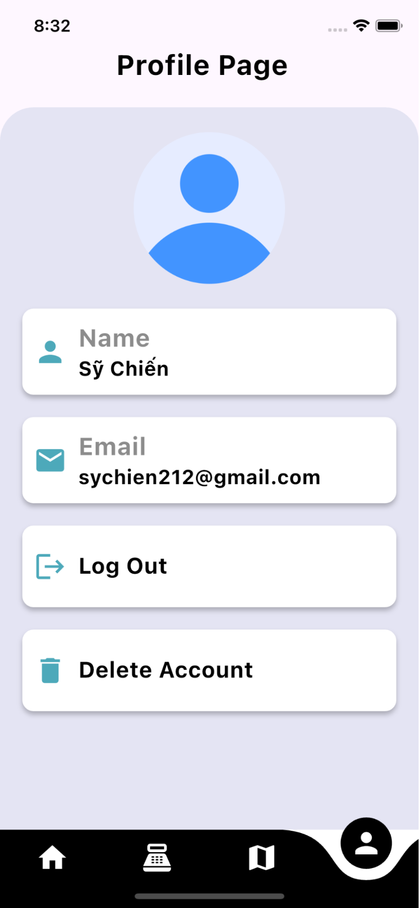

3. Các tính năng chính của người dùng

  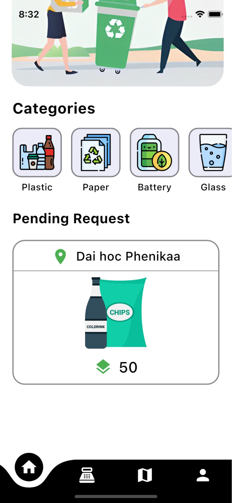
  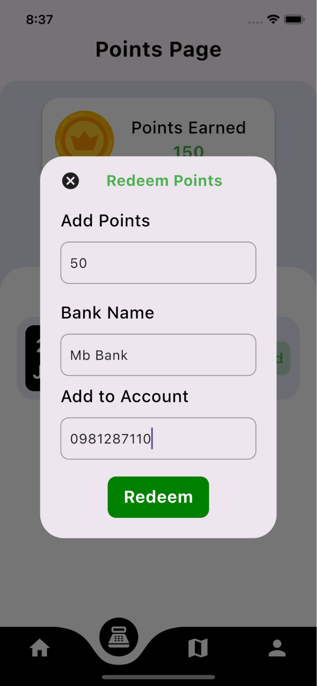
  
  

4. Các chức năng của quản trị viên

  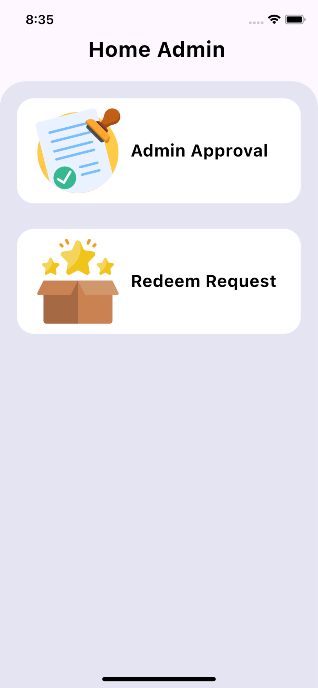
  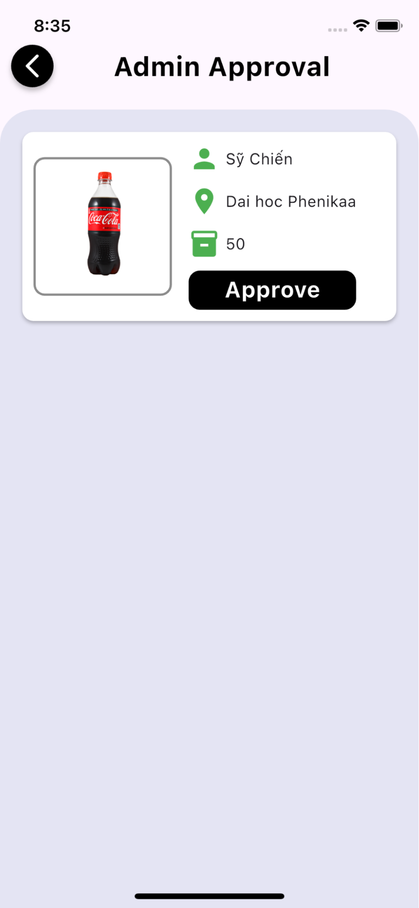
  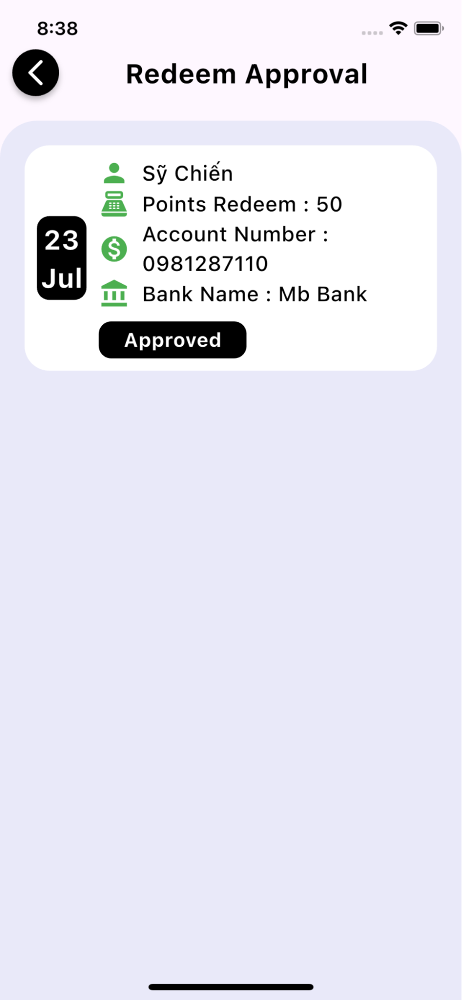

## 🛠️ Công nghệ sử dụng
- Flutter, Dart
- Firebase (Auth, Firestore)
- Google Maps API
- Shared Preferences
- Image Picker
- Material Design

## 📄 Ghi chú

Dự án phục vụ mục đích học tập, không sử dụng cho mục đích thương mại.

